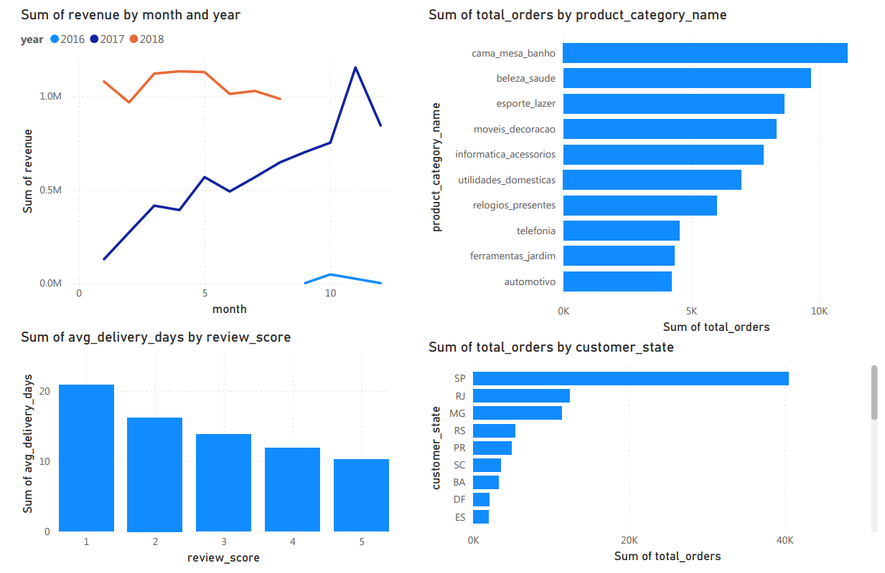

# Olist E-commerce Analysis

## Bài toán kinh doanh
Phân tích dữ liệu bán hàng của Olist — sàn thương mại điện tử lớn nhất Brazil
để tìm ra các yếu tố ảnh hưởng đến doanh thu và sự hài lòng của khách hàng.

## Dataset
- Nguồn: Kaggle — Brazilian E-commerce Public Dataset by Olist
- 99,441 đơn hàng từ 2016 đến 2018
- 8 bảng dữ liệu liên kết

## Công cụ sử dụng
- Python / pandas — làm sạch và phân tích dữ liệu
- SQL — truy vấn dữ liệu
- Power BI — trực quan hóa

## Insights chính
1. Tháng 11/2017 có doanh thu cao nhất (1.15M) — có thể do Black Friday
2. São Paulo chiếm gần 42% tổng đơn hàng toàn quốc
3. Cama_mesa_banho là danh mục bán chạy nhất với 11,115 đơn
4. Thời gian giao hàng tương quan trực tiếp với điểm review — đơn giao 10 ngày được 5 sao, đơn giao 21 ngày chỉ được 1 sao
5. 58% khách hàng cho điểm 5 — mức độ hài lòng tổng thể tốt

## Đề xuất
1. Cải thiện logistics để giảm thời gian giao hàng xuống dưới 10 ngày
2. Tập trung phát triển thị trường ngoài São Paulo để giảm phụ thuộc
3. Ưu tiên đầu tư vào danh mục cama_mesa_banho và beleza_saude

## Dashboard

